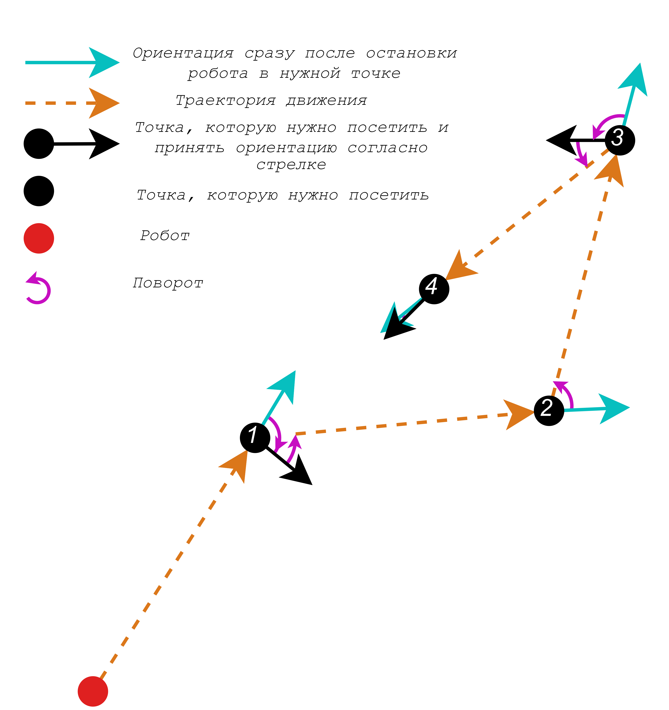
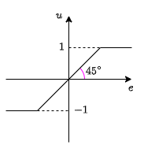

# Теория
На рисунке изображена схема посещения роботом точек:

Движение осуществляется по следующей схеме:
1. Поворот на месте из текущей позы в нужную позу для начала прямолинейного движения к нужной точке
2. Прямолинейное движение к нужной точке
3. Поворот на месте из текущей позы в конечную позу
## Прямолинейное движение
Прямолинейное движение будет осуществляться без остановки с регулировкой силы поворота и силы прямолинейного движения П-регулятором (пропорциональным регулятором). Робот будет ехать за так называемым ==Солнцем== $S$, которое находится на $l$ на фиксированном расстоянии от проекции $R$ на $l$ (точка $H$), равном $p$ и задающемся пользователем. Идея в том, что $S$ всегда ведет робота к идеальной траектории (прямой), на протяжении всего пути. Робот будет колебаться, пересекая прямую вверх и вниз, но амплитуда таких колебаний уменьшается со временем, значит система устойчива. Робот будет стараться проехать четко по вектору $\vec{r}$, который постепенно будет все больше сонаправлен с $\vec{a}$.

Разобьем воздействие на моторы на 2 компоненты: прямолинейное движение и поворот (с равными весами).
Чтобы использовать П-регулятор, необходимо знать отклонение текущего значения величины от требуемого.
### Прямолинейная компонента:
На оба мотора подается одинаковый сигнал, пропорциональный расстоянию от робота до целевой точки, т.е. $\propto \left|\vec{t}\right|$. $\vec{t}=\left( \begin{matrix} x_T - x_R \\ y_T - y_R \\ \end{matrix} \right)$. Обозначим воздействие на левый мотор как $left\_motor$, а на правый, как $right\_motor$, тогда
$$left\_motor = k_{forward} \cdot \left|\vec{t}\right|$$ $$right\_motor = k_{forward} \cdot \left|\vec{t}\right|$$
Т.к. максимальное значение на вход моторов $\in [-1;1]$, необходимо ограничить значение, для этого применим нелинейную характеристику типа "зона нечувствительности:

Занесем ее в функцию $u=\text{compress}(e)$, тогда$$left\_motor = \text{compress} \left(k_{forward} \cdot \left|\vec{t}\right| \right)$$$$right\_motor = \text{compress} \left(k_{forward} \cdot \left|\vec{t}\right| \right)$$
где $\text{compress}(x) = \left\{ \begin{matrix} 1, \text{ если } x>1, \\  x, \text{ если } x \in \left[-1;1\right], \\ -1, \text{ если } x< -1.\\ \end{matrix} \right.$
### Поворотная компонента:
Помимо прямого движения, очевидно, необходимо "рулить", но как?
Цель - доехать до цели по прямой. Есть 2 точки $\Rightarrow$ можно задать уравнение прямой, найти ее направляющий вектор и нормаль к этому направляющему вектору.
Прямая $l$ проходит через 2 точки: $O = (x_0;y_0)$ и  $T=(x_T;y_T)$, тогда направляющий вектор будет равен
$$\vec{a} = \left( \begin{matrix} x_T-x_0 \\ y_T - y_0 \\ \end{matrix} \right).$$
Уравнение прямой на плоскости выглядит следующим образом:
$$l:Ax+By+C=0, A^2+B^2>0,$$
но из аналитической геометрии известно, что направляющий вектор для такой прямой имеет координаты $$\vec{a} = \left( \begin{matrix} a_1\\ a_2 \\ \end{matrix} \right)=\left( \begin{matrix} -B \\ A \\ \end{matrix} \right),$$
$$\Rightarrow \left\{ \begin{matrix}B=-a_1, \\ A=a_2 .\end{matrix}\right.$$
$$(x_T;y_t) \in l \Rightarrow Ax_T+By_t+C=0 \Rightarrow C = -Ax_T-By_t = -a_2x_T + a_1y_T.$$
Т.е. 
$$\left\{ \begin{matrix}B=-a_1, \\ A=a_2, \\ C=a_2x_T + a_1y_T.\end{matrix}\right.$$
Нормаль для направляющего вектора $\vec{a}$ равна 
$$\vec{n}=\left( \begin{matrix} A\\ B \\ \end{matrix} \right)=\left( \begin{matrix} a_2\\ -a_1 \\ \end{matrix} \right).$$
Далее требуется получить относительное расположение робота (точки $R$ относительно $l$). Можно рассуждать следующим образом: если точку $R$ можно получить из какой-нибудь точки прямой $l$ смещением по направлению нормали $\vec{n}$, то $R$ находится *СПРАВА* от вектора $\vec{a}$, а если против направления, то *СЛЕВА*.
Действительно, во-первых, нормаль, определенная таким образом смотрит всегда влево от направления вектора $\vec{a}$:
$$\left[\vec{n} \times \vec{a} \right]=\left| \begin{matrix} \vec{i} & \vec{j} & \vec{k} \\ A & B & 0 \\ -B & A & 0 \\ \end{matrix} \right|= \left( \begin{matrix} 0 \\ 0 \\ A^2+B^2 \\ \end{matrix} \right), A^2+B^2 >0 \text{ по условию },$$
т.е. эти 2 вектора всегда ориентированы одинаково друг относительно друга.
Введем параметр относительно расположения $s$, равный $1$, Если $R$ *СЛЕВА*, и равный -1, если $R$ *СПРАВА*:
.png)
Он позволит в дальнейшем корректно осуществлять поворот.
Итак, а как же математически получить, каким именно смещением: *по* или *против* нормали, была получена точка $R$?
Как уже говорилось выше, $R$ получена сдвигом из какой-то точки $(x_*;y_*)\in l: Ax+Bx+C=0$, т.е. $R = (x_R;y_R)=(x_*+kn_1;y_*+kn_2)$, где $n_1$ и $n_2$ – компоненты вектора $\vec{n}$, а $k \in \mathbb{R}$ – какой то коэффициент, задающий длину.
Тогда Понаблюдаем за выражением $Ax+Bx+C$:
$$A(x_*+kn_1)+B(y_*+kn_2)+C = A(x_*+kA)+B(y_*+kB)+C =$$$$Ax_*+By_*+C+k\left(A^2+B^2\right),$$
но $Ax_*+By_*+C=0$, т.к. $(x_*;y_ *) \in l$ $\Rightarrow$
$$A(x_R)+B(y_R)+C = k\left(A^2+B^2\right), A^2+B^2>0.$$
Следовательно по знаку левой части уравнения прямой $l$, в которую подставили координаты робота $(x_R;y_R)$, можно определить знак $k$, а значит и направление смещение ($k>0$ – по нормали и $s=-1$, $k<0$ – против нормали и $s=1$).
Т.е. теперь можно задать выражение для $s$:
$$s=-sign\left(Ax_R+By_R+C\right).$$
Введем угловое отклонение ориентации робота от идеальной траектории:
$$\delta=\theta - \alpha.$$
Это позволит ввести 1 правило: если ориентация робота далека от направления прямой, то робот остановится и сначала повернется, чтобы доехать до прямой, по которой ему и следует ехать. Грубо говоря, ориентация робота входит в сектор предельного наружного отклонения $\beta_{max}$. Условие этого записывается следующим образом:
>[!Danger] Если $s\delta>\beta_{max}$, отключаем прямолинейную компоненту на моторы (поворот на месте)

Теперь можно перейти непосредственно к алгоритму поворота.
На рисунке выше видно, что требуется развернуть робота на угол $\gamma=\theta-\varphi$, где $\varphi = \arg{\vec{r}}$.
$$\arg{\vec{a}} = \begin{cases}
        arctg \left( \frac{a_y}{a_x} \right)\, \text{ если } a_x > 0, \\
        \frac{\pi}{2} \cdot sign(a_y), \text{ если } a_x = 0, \\
        \pi + arctg \left( \frac{a_y}{a_x} \right), \text{ если } a_x < 0.
        \end{cases}$$
Сам вектор $\vec{r}$ вычисляется путем его разложения на $\vec{h}+\vec{p}=\frac{\vec{n}}{|\vec{n}|}\cdot s\cdot h + \frac{\vec{a}}{|\vec{a}|} \cdot p$:
$$\vec{r}=\left(\begin{matrix}\frac{n_1\cdot s \cdot h}{|\vec{n}|}+ \frac{a_1 \cdot p}{|\vec{a}|} \\ \frac{n_2\cdot s \cdot h}{|\vec{n}|}+ \frac{a_2 \cdot p}{|\vec{a}|}\end{matrix} \right),$$
где расстояние от $R$ до прямой $l$ вычисляется следующим образом:
$$h=\frac{\left|Ax_R+By_R+C \right|}{\sqrt{A^2+B^2}}.$$
Итоговая формула для поворотной компоненты с учетом сжатия сигнала:
$$left\_motor = \text{compress} \left(k_{rotate} \cdot \gamma \right)$$$$right\_motor = -\text{compress} \left(k_{rotate} \cdot \gamma \right)$$
### Композиция движений:
Сложим эти 2 компоненты с одинаковым весом 1/2, чтобы итоговый сигнал $\in [-1;1]$:
$$left\_motor = \frac{1}{2}\text{compress} \left(k_{forward} \cdot \left|\vec{t}\right| \right) + \frac{1}{2}\text{compress} \left(k_{rotate} \cdot \gamma \right)$$$$right\_motor = \frac{1}{2}\text{compress} \left(k_{forward} \cdot \left|\vec{t}\right| \right) - \frac{1}{2}\text{compress} \left(k_{rotate} \cdot \gamma \right)$$
## Поворот
Как вариант - можно просто использовать поворот без прямолинейной составляющей, таким образом, обратная связь будет учитывать только ориентацию, однако на практике вполне вероятна ситуация, когда во время поворота произойдет смещение центра робота из своего первоначального положения, можно запариться и написать алгоритм поворота с учетом обратной связи по положению (оставлю открытое окно для этого в виде аргументов метода), но пока времени нет, так что забиваем на такой расклад событий.
Угловое отклонение ориентации робота от идеальной траектории:
$$\delta=\theta - \alpha.$$
$$left\_motor = \text{compress} \left(k_{rotate} \cdot \delta \right)$$
$$right\_motor = -\text{compress} \left (k_{rotate} \cdot \delta \right)$$
## Конечный алгоритм
1. Ввод цели $(x_T;y_T)$, целевой ориентации $orient_T$, расстояния маяка $p$
2. Ввод текущих начальных координат $(x_0;y_0)=(x_R;y_R)$
3. Расчет направляющего вектора по формуле $\vec{a} = \begin{pmatrix} x_T - x_0  \\ y_T - y_0 \end{pmatrix}$
4. Расчет коэффициентов уравнения прямой:$$\left\{ \begin{matrix}B=-a_1, \\ A=a_2, \\ C=a_2x_T + a_1y_T.\end{matrix}\right.$$
5. Вычисление нормали: $$\vec{n}=\left( \begin{matrix} A\\ B \\ \end{matrix} \right)$$
6. Вычисление $\alpha$ по формуле $$\alpha = \arg{\vec{a}}$$
7. Поворот на месте перед началом прямолинейного движения (Осуществляется по циклу, пока не выполнено условие):
    - Ввод текущих координат $(x_R;y_R)$ и текущей ориентации $\theta$
    - Вычисление $\delta =\theta - \alpha$
    - Проверка условия $\left| \delta \right| \le accuracy\_orient$. Если выполнено, то выход из цикла
    - Иначе:
	    - Расчет управляющих сигналов на оба мотора:
        $$left\_motor = \text{compress} \left(k_{rotate} \cdot \delta \right)$$$$right\_motor = -\text{compress} \left (k_{rotate} \cdot \delta \right)$$
8. Прямолинейное движение (Осуществляется по циклу, пока не выполнено условие):
    - Ввод текущих координат $(x_R;y_R)$ и текущей ориентации $\theta$
    - Вычисление вектора $\vec{t}$: $$\vec{t}=\left( \begin{matrix} x_T - x_R \\ y_T - y_R \\ \end{matrix} \right)$$
    - Проверка условия $\left| \vec{t} \right| \le accuracy\_pos$. Если выполнено, то выход из цикла
    - Иначе:
	    - Вычисление расстояния от $R$ до $l$: $$h=\frac{\left|Ax_R+By_R+C \right|}{\sqrt{A^2+B^2}}.$$
	    - Вычисление параметра относительного расположения $R$ и $l$:$$s=-sign\left(Ax_R+By_R+C\right).$$
		- Вычисление вектора движения к прямой $\vec{r}$: $$\vec{r}=\left(\begin{matrix}\frac{n_1\cdot s \cdot h}{|\vec{n}|}+ \frac{a_1 \cdot p}{|\vec{a}|} \\ \frac{n_2\cdot s \cdot h}{|\vec{n}|}+ \frac{a_2 \cdot p}{|\vec{a}|}\end{matrix} \right)$$
		- Вычисление угла $\varphi = \arg{\vec{r}}$ и угла $\gamma=\theta-\varphi$, на который роботу следует повернуться
		- Вычисление $\delta =\theta - \alpha$
	    - Расчет управляющих сигналов на оба мотора:
		    - Если $s\delta>\beta_{max}$, отключаем прямолинейную компоненту:$$left\_motor = \text{compress} \left(k_{rotate} \cdot \gamma \right)$$$$right\_motor = - \text{compress} \left (k_{rotate} \cdot \gamma \right)$$
		    - Иначе:$$left\_motor = \frac{1}{2} \text{compress}(k_{forward} \cdot \left|\vec{t}\right|) + \frac{1}{2} \text{compress} \left(k_{rotate} \cdot \gamma \right)$$$$right\_motor = \frac{1}{2} \text{compress}(k_{forward} \cdot \left|\vec{t}\right|) - \frac{1}{2} \text{compress} \left (k_{rotate} \cdot \gamma \right)$$
9. Поворот на месте на целевой угол (Осуществляется по циклу, пока не выполнено условие):
	- Ввод текущих координат $(x_R;y_R)$ и текущей ориентации $\theta$
    - Вычисление $\delta =\theta - orient_T$
    - Проверка условия $\left| \delta \right| \le accuracy\_orient$. Если выполнено, то выход из цикла
    - Иначе:
	    - Расчет управляющих сигналов на оба мотора:
        $$left\_motor = \text{compress} \left(k_{rotate} \cdot \delta \right)$$$$right\_motor = -\text{compress} \left (k_{rotate} \cdot \delta \right)$$
11. Отправка ответа об успешном достижении цели

#Робототехника